# TL25MHLDev

In this lab we perform two hacks against two intentionally vulnerable VM
targets. The first target is a Metasploitable VM which is a great target
to practice on as it has many vulnerabilities. The second target is a
dated Windows 7 VM that has not been patched for the critical
eternalblue exploit.

We begin each hack the same way, by doing recon with NMAP. For the first
attack, we already know the IP address.

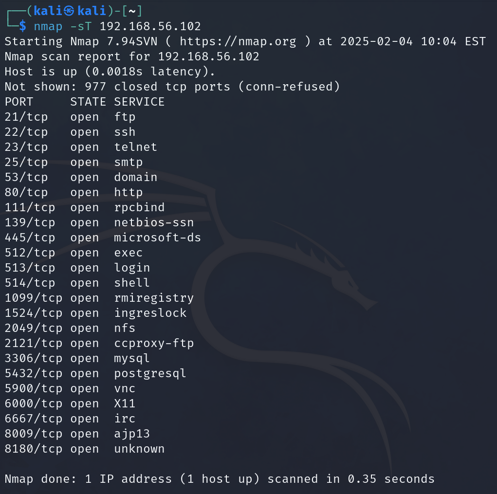If we wanted to go even further,
we could use the –p## parameter to specify a port, but it is not
required to do so at this time.

From the results above, we can see that port 21 is open and that this
port is commonly used for ftp. We can try to connect to that port using
netcat to demonstrate the first hack.

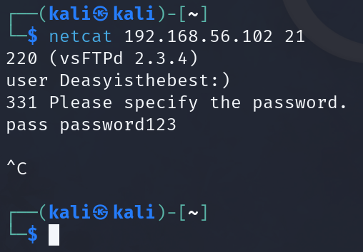

Once we connect to the machine with netcat, we see it is running the
vulnerable version of vsFTPd, so we type in a username that ends with
“:)" and any password. Nothing happens of course, because that username
and password combination do not exist, so we exit with ctrl+c.

Using nmap again, we can peek at the port 6200 and now see that it is
open. Not that unless we use the –sS parameter, the port will close and
we will need to connect with netcat again. In my testing, it sometimes
closes the port even if –sS is used.

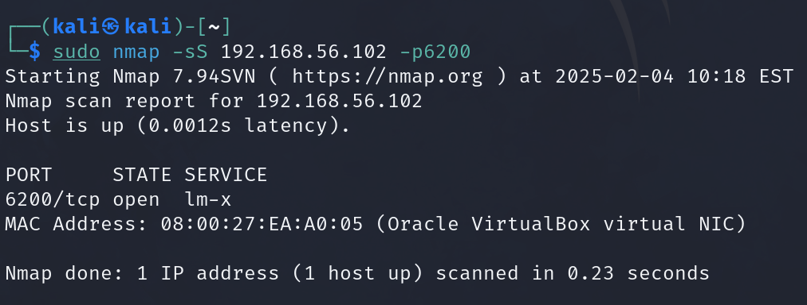Once we are sure the port is
open, we can connect to it with netcat and verify we are connected using
command like ”id”, ”ls”, and ”ip a”.

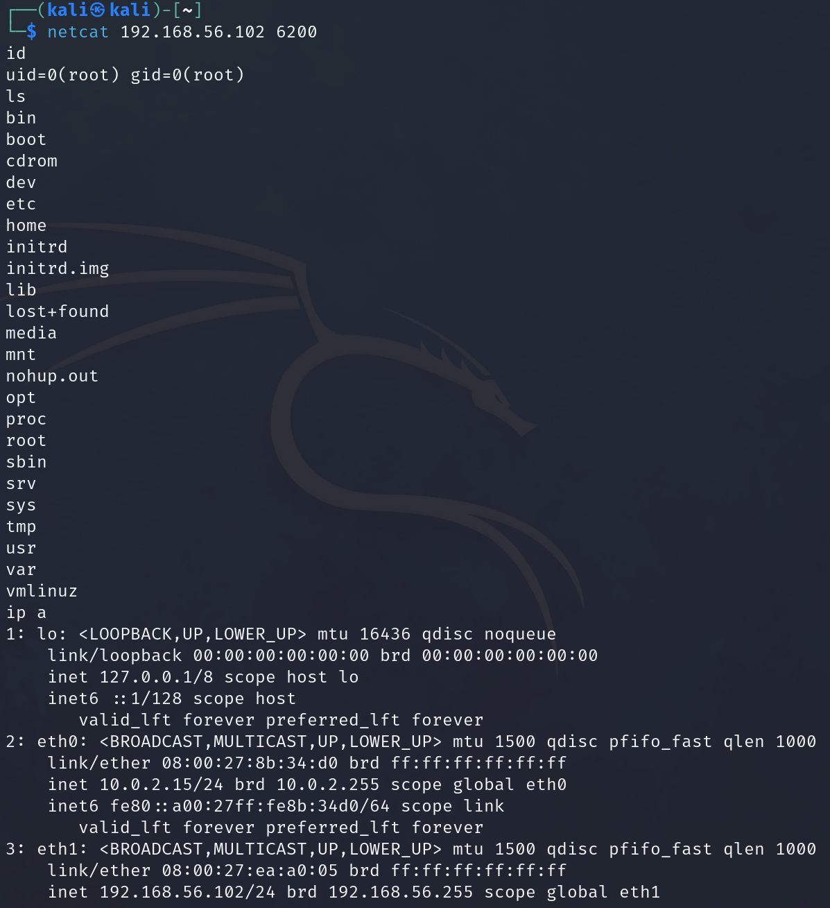

Now that we have demonstrated a hack without metasploit, let’s see how
much easier it is when using metasploit. Metasploit can be launched with
the msfconsole command or by selecting it from the start menu.

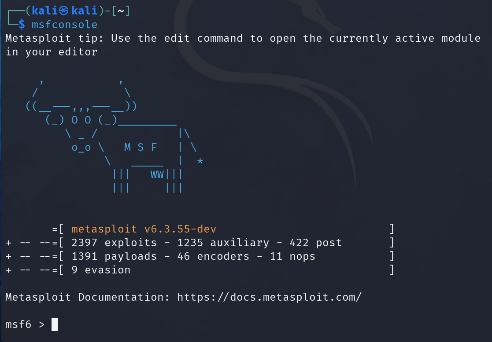

The prompt will change from kali to msf6 once we are in. A random ascii
image will be present as well, it might be different from the one your
neighbor gets. We can search for the module we wish to use, in this case
the vsFTPd exploit. We are going to use the one ranked excellent.

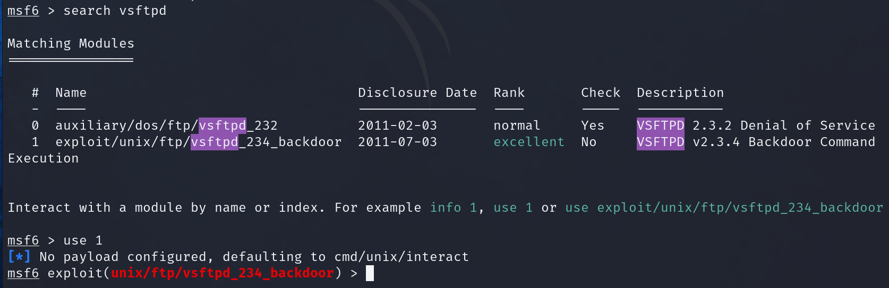

Once loaded, we can show the options to see that the only required one
without a default setting is rhosts, so we set that one to the IP of our
metasploitable VM. Then we simply run it and wait a moment. Sometimes it
needs to be run twice.

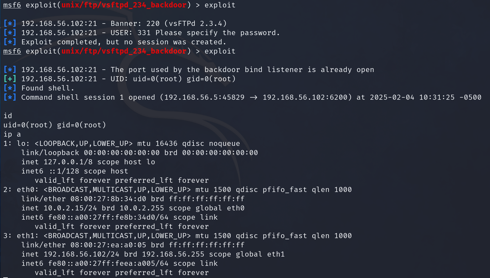

We can verify we are in using the same command as earlier, but we can
also do more, like shutting down the server.

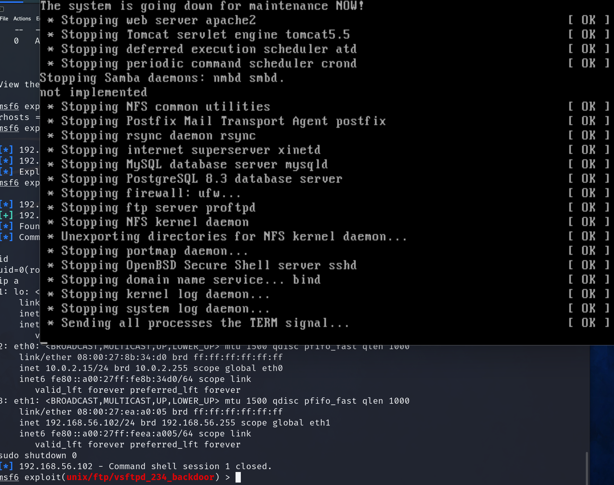

We can now close and revert this VM.

For our next hack, we will launch the Blue VM. It is a windows 7
machine. Silly me forgot the passwords to the VM, so we can’t even login
to get the IP addresses, which I’ve also conveniently forgotten as well.
Luckily, nmap can save us here.

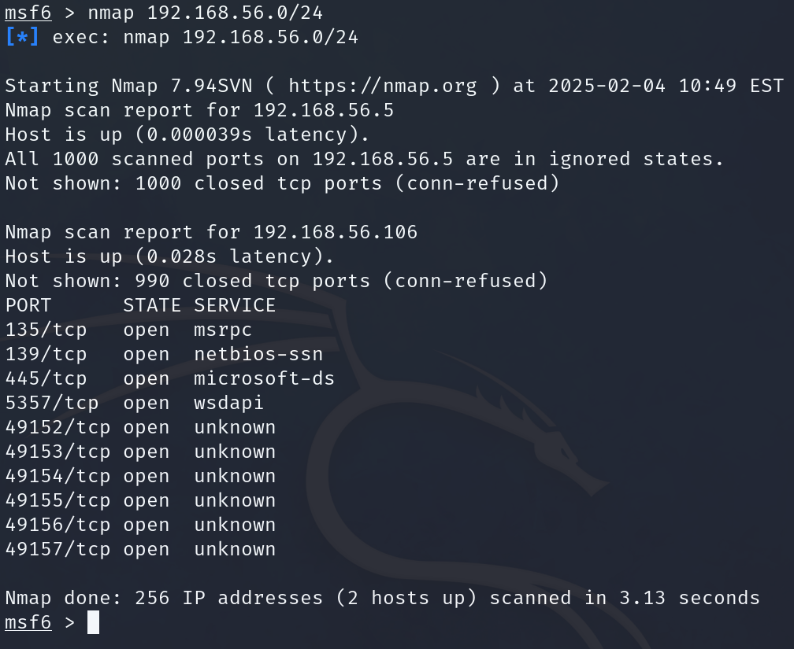

A basic scan of the whole subnet reveals our VM’s IP. Now we can search
for eternalblue.

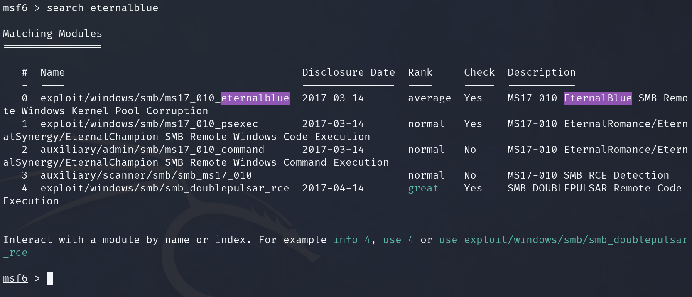

We’re going to use the one under
exploit/windows/smb/ms17_010_eternalblue, then show options.

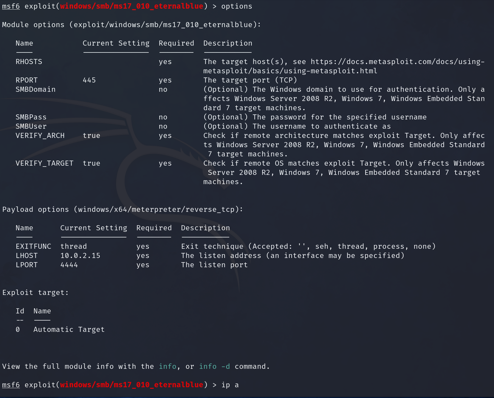

We can see we need to set rhosts again, but also that we should change
lhost to our ip. To get our IP we use the “ip a” command.

Once set, we can run the exploit
and wait while it performs a series of complicated tasks that hopefully
ends with a win message and a meterpreter prompt.

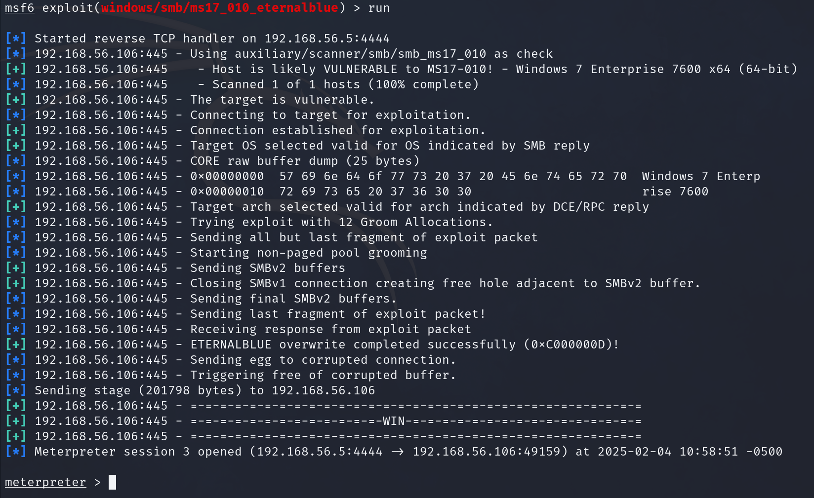

That was easy, but what can we do now? Shutting down the machine doesn’t
help us login to it. We can run the command “hashdump” to get the user
password hashes.

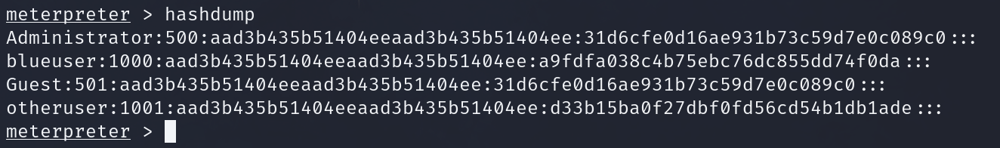

Let’s open a new terminal window and type “mousepad passwerds.txt.” and
paste those hashes into it. We can then save and close the text file but
keep the terminal window open.

We can then launch the wordlists from the start menu by going to
start-\>05 Password Attacks-\>Password Profiling &
Wordlists-\>wordlists. Select Y on the window that pops up.

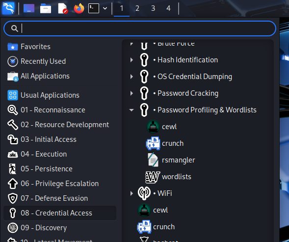

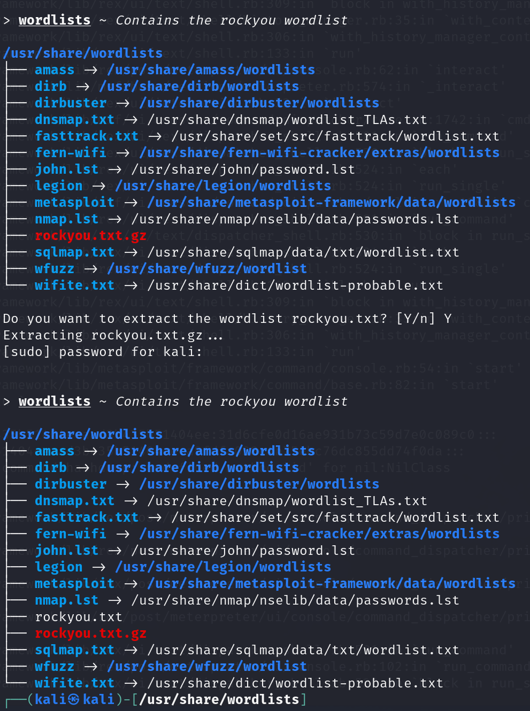

After typing in Y, you may be asked for the sudo password, it’s kali.

Now that we have both the passwerds.txt file, and our rockyou.txt
wordlist, we can use john the ripper to crack the hashes we obtained
from the Blue VM. In the same terminal window we used to type the
mouspad command, or a new one. Launch john using the following command:
john --wordlist=/usr/share/wordlists/rockyou.txt passwerds.txt
--format=NT

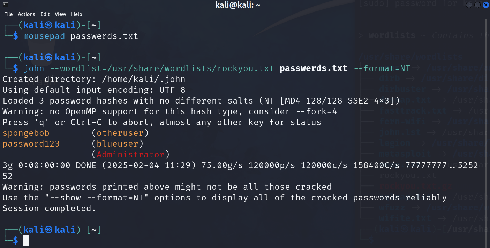

This is the reason you have been told not to use a single word or
variation thereof as your password. If any of the passwords listed in
rockyou.txt are yours, change them. I recommend using a short sentence.

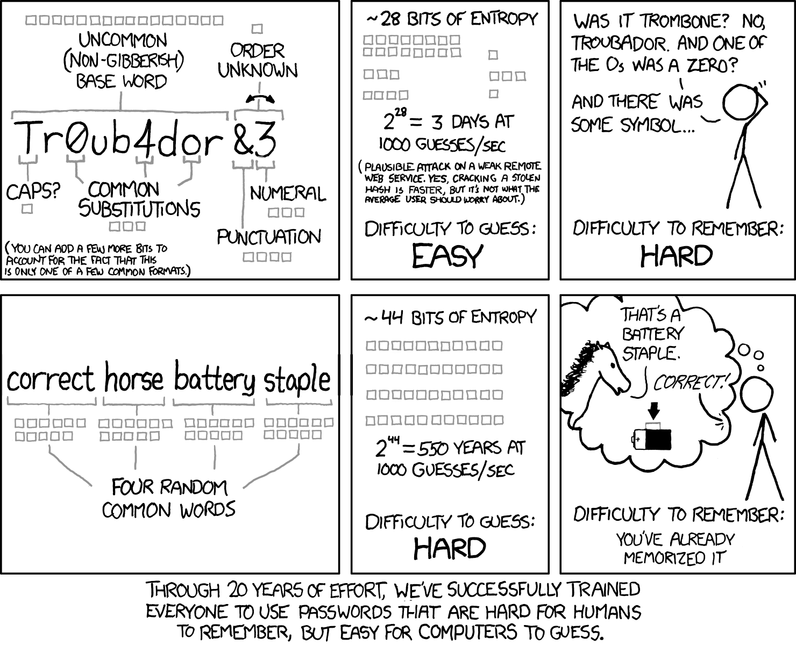

If you see something like the output below instead of the output above,
it means that someone has already cracked those passwords on this
machine and has not cleaned up after themselves.

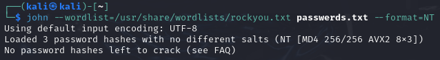

To force John to forget that the passwords have been cracked, type the
following, using tab when necessary to autocomplete.

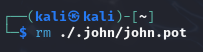

Now you can run the John command from above by pressing the up-arrow key
and it should give you the cracked passwords.

Alternatively, since they’d already been cracked, you can just open the
john.pot file to see them using the following command.

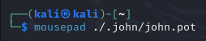
